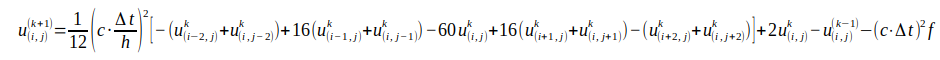
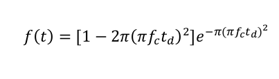

# mdf-onda-acustica
## proposta

O programa tem a intenção de simular a propagação de ondas no espaço bidimensional. Para tal, é necessário realizar uma discretização da equação da onda.
O método escolhido para tal foi o Método das Diferenças Finitas (MDF). 

## método das diferenças finitas
A equação da onda é uma Equação Diferencial Parcial (EDP) de segunda ordem. Realizando uma expansão de Taylor de segunda ordem no tempo e quarta ordem no espaço,
chegamos na forma iterativa de calcular cada ponto (i, j) no passo k + 1 no tempo:

Onde c é a velocidade da onda no meio, h a distância entre cada ponto do domínio (largura da malha) e f a função fonte (pulso) dada por:

## condições de contorno

Para evitar que aconteça reflexão da onda na borda do modelo é necessário aplicar alguma condição de contorno. 
A condição adotada foi a de amortecimento da onda nas bordas, isto é, para cada i no intervalo [0, d] e [X_max - d, X_max] e para cada
j no intervalo [0, d] e [Z_max - d, Z_max] foi aplicada uma atenuação no valor de u para aquele ponto, que é proporcional à distância 
do ponto até a borda do modelo. 

## implementação

